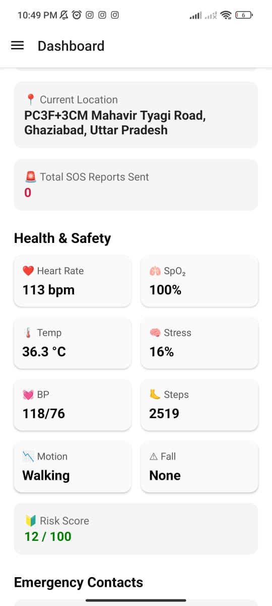
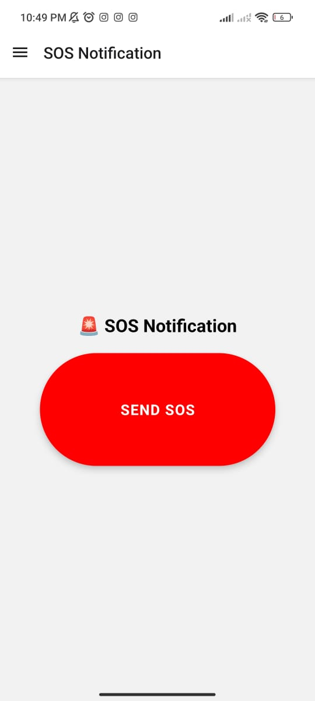
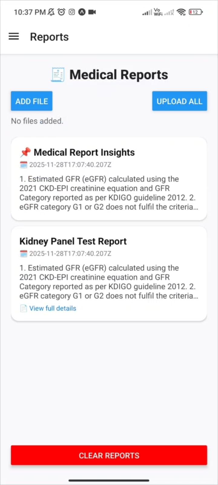
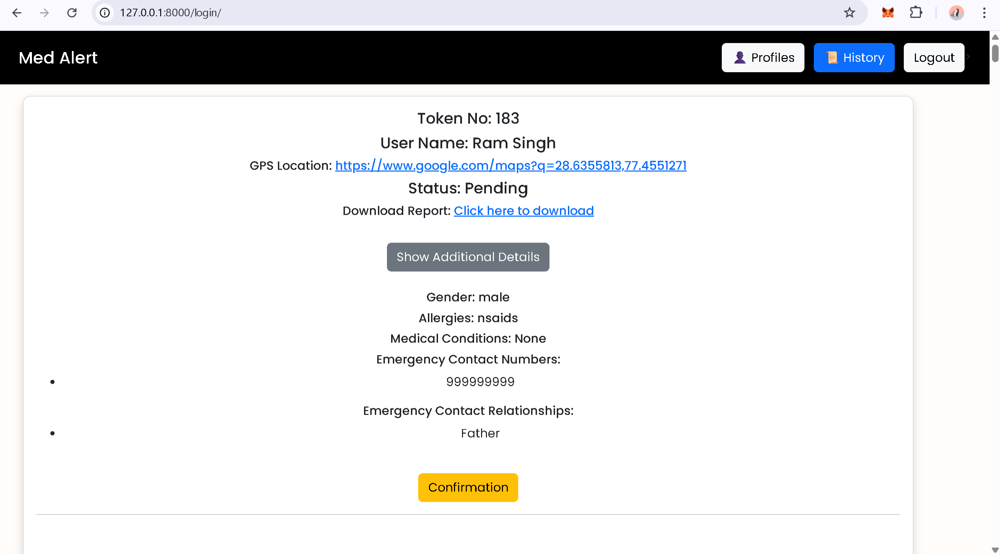
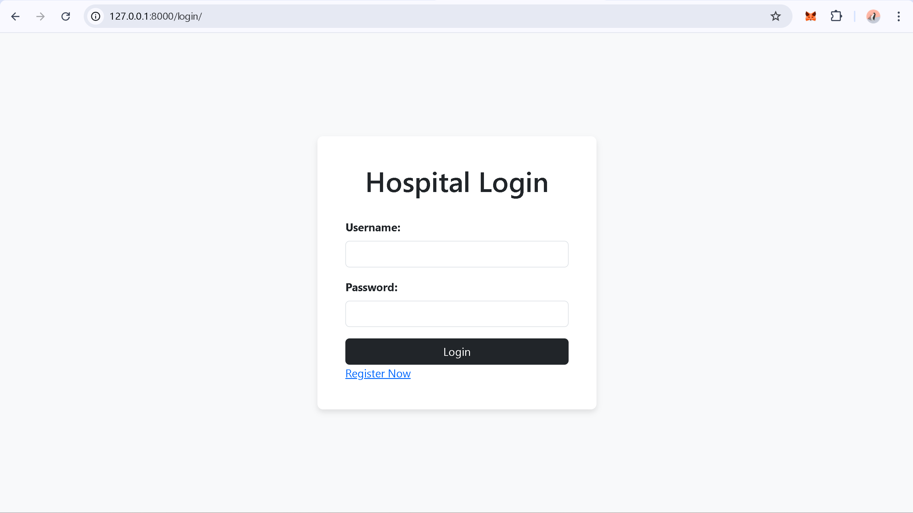

# 🚑 MedAlert – Real-Time Medical SOS System

MedAlert is a **real-time medical emergency (SOS) platform** designed to deliver **instant alerts** to family members and nearby hospitals with critical patient data, enabling faster response and improved hospital preparedness.

---

## 🔑 Key Features

- **Real-Time SOS Alerts**  
  Instantly notifies family and **nearest hospitals** with live location, vital signs, and medical history.

- **Cross-Platform Support**  
  Fully functional **Web (Django)** and **Mobile App (React Native)** with identical SOS features.

- **AI-Powered Intelligence**  
  - **AI-based risk score analysis**  
  - **AI-generated medical report summaries** from uploaded reports for quick hospital insights before patient arrival.

- **Smart Hospital Discovery**  
  Displays nearby hospitals with **ICU/bed availability**, emergency calling, and **navigation support**.

- **Automated Emergency Communication**  
  Sends alerts via **Twilio WhatsApp API** and integrates real-time health data using **Google Fit API**.

---

## 📱 Mobile App Screenshots

| SOS Screen | Health Data | Emergency Flow |
|----------|-------------|----------------|
|  |  |  |

---

## 🏥 Hospital Dashboard Screenshots

| Dashboard Overview | Patient Insights |
|-------------------|------------------|
|  |  |

---

## 🛠️ Tech Stack

- **Backend:** Python, Django  
- **Mobile App:** React Native  
- **Frontend:** HTML, JavaScript, Tailwind CSS, Bootstrap  
- **APIs:** Google Fit API, Twilio WhatsApp API  
- **Data & Analysis:** Pandas, Matplotlib  
- **AI:** Risk Scoring & Medical Report Summarization  

---

## 🚀 Use Case

Designed for **critical medical emergencies**, MedAlert ensures hospitals receive **actionable patient insights in seconds**, improving treatment readiness and saving valuable time.

---

## 📌 Note

This project focuses on **speed, reliability, and real-world emergency workflows**, making it suitable for healthcare and enterprise-scale deployment.
